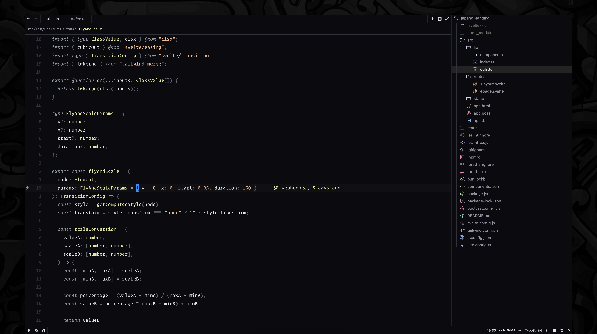

# Oscura for Zed

An unapologetically dark and minimal colorscheme for Zed. Meticulously curated accent colors and precisely balanced contrast craft a sophisticated coding environment that's both elegant and easy on the eyes.



## Features

- **Deep Contrast**: The Oscura theme features carefully selected colors that provide excellent readability while remaining gentle on the eyes during long coding sessions.
- **Minimal Design**: Clean and distraction-free interface that helps you focus on your code.
- **Syntax Highlighting**: Thoughtfully designed syntax highlighting that makes code structure immediately apparent.

## Installation

### From Zed Extension Catalog

1. Open Zed
2. Open the command palette (Cmd+Shift+P or Ctrl+Shift+P)
3. Type "Extensions: Install Extension"
4. Search for "Oscura"
5. Click "Install"

## Recommended Settings

For the best experience, we recommend these settings in your Zed configuration:

```json
{
  "ui_font_family": "SF Pro",
  "buffer_font_family": "Berkeley Mono Variable",
  "buffer_font_size": 14,
  "buffer_line_height": 1.6
}
```

## About

This theme is inspired by the original Oscura Theme by Fey, adapted for the Zed editor. It follows the same design principles and color palette while being optimized for Zed's interface.

## Credits
- Original [Oscura Theme](https://github.com/narative/oscura) by the Fey team 